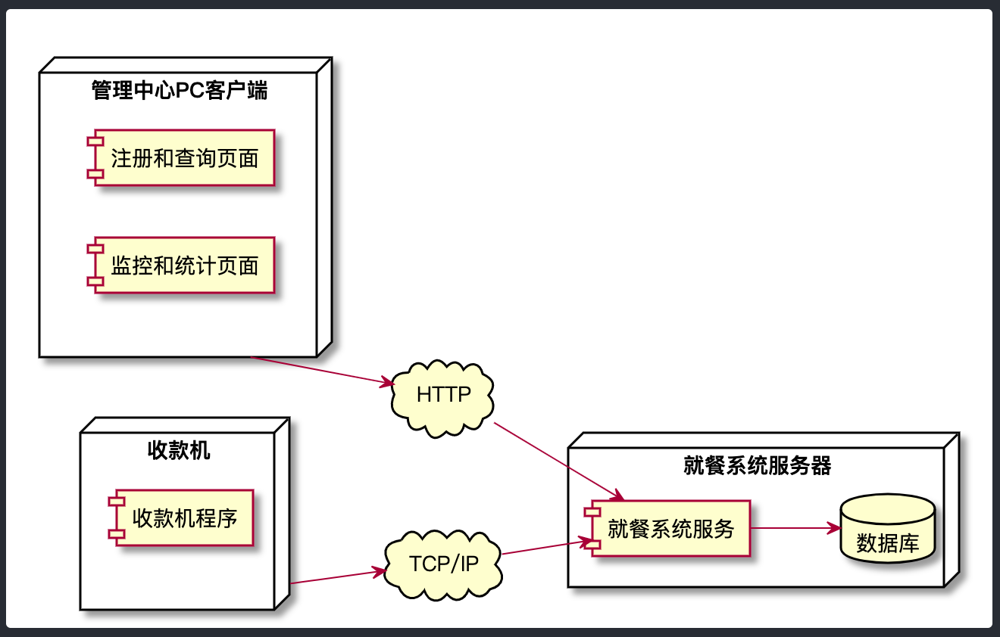
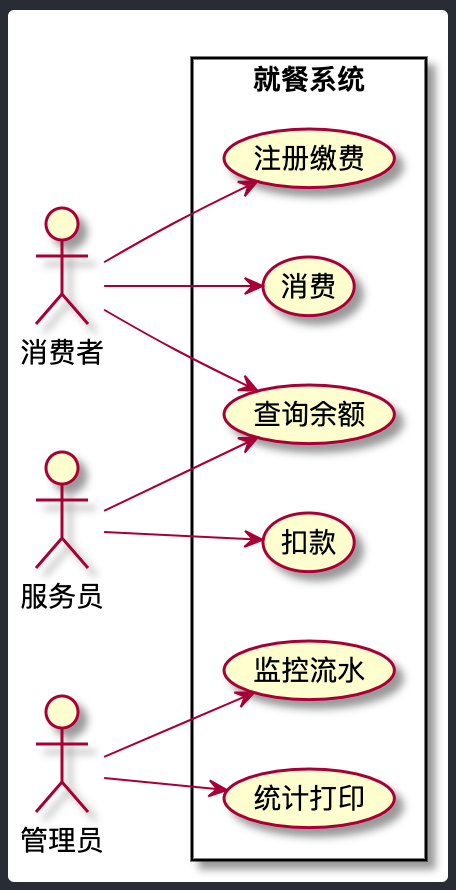
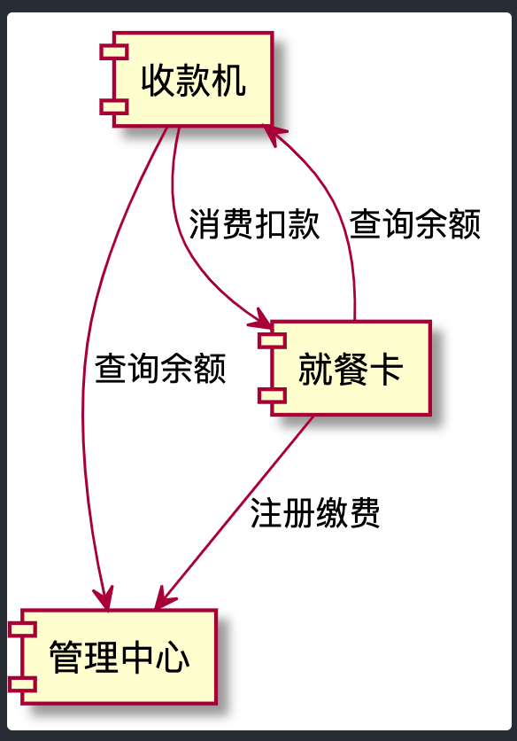
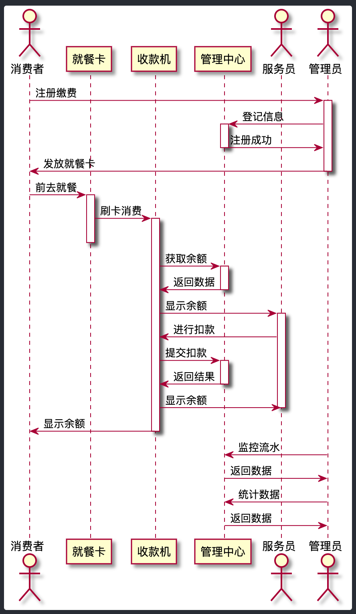

# 作业一：食堂就餐卡系统设计

- 系统中每个`消费者`都有一张卡，在`管理中心`注册缴费，卡内记着消费者的身份、余额。
- 使用时将卡插入`收款机`则显示卡上金额，`服务员`按收款机上数字键，收款机自动计算并显示消费额及余额。
- 管理中心的`管理员`监视每一笔消费，可打印出消费情况的相关统计数据。

请设计系统用例图，组件图，组件时序图，部署图。

# 作业二：根据当周学习情况，完成一篇学习总结

作业提交：
作业提交地址： https://jinshuju.net/f/WWy0zT
提交截止时间：6 月 11 日（周四）0:00 前

## 食堂就餐卡系统设计

### 部署图



```
@startuml
left to right direction
node "收款机" as skj {
    component "收款机程序"
}

node "管理中心PC客户端" as gl {
    component "注册和查询页面"
    component "监控和统计页面"
}

cloud "TCP/IP" as tcp

cloud "HTTP" as http

node "就餐系统服务器" as fw {
    component "就餐系统服务" as server
    database "数据库" as db
}

skj --> tcp
tcp --> server
gl --> http
http --> server
server --> db
@enduml
```

1. 收款机放在就餐的食堂中，其中部署了收款机程序，以TCP/IP方式，当消费者刷卡后，程序调用系统接口获取卡内余额；服务员操作收款机进行自动扣款，并更新到数据库中；
2. 就餐系统服务器中部署就餐系统服务以及数据库；
3. 管理中心PC客户端具有注册、查询、监控、统计、打印等功能，其通过HTTP方式与系统连接，管理员通过PC端浏览器访问管理页面进行操作。

### 用例图



```
@startuml
left to right direction

actor "消费者" as xfz
actor "服务员" as fwy
actor "管理员" as gly

rectangle "就餐系统" as jcxt {
    usecase "注册缴费" as uc1
    usecase "查询余额" as uc2
    usecase "消费" as uc3
    usecase "扣款" as uc4
    usecase "监控流水" as uc5
    usecase "统计打印" as uc6
}

xfz --> uc1
xfz --> uc2
xfz --> uc3
fwy --> uc2
fwy --> uc4
gly --> uc5
gly --> uc6
@enduml
```

1. 消费者有注册缴费功能，获取就餐卡后可通过收款机进行查询余额、进行消费功能；
2. 服务员具有查询就餐卡余额、进行扣款的功能；
3. 管理员通过管理中心的客户端可进行监控流水、统计数据并打印功能。

### 组件图



```
@startuml
component "管理中心" as glzx
component "收款机" as skj
component "就餐卡" as jck

jck --> glzx: 注册缴费
skj --> glzx: 查询余额
skj --> jck: 消费扣款
jck --> skj: 查询余额
@enduml
```

系统包含管理中心、收款机、就餐卡三个组件。

### 组件时序图



```
@startuml

actor "消费者" as xfz
participant "就餐卡" as jck
participant "收款机" as skj
participant "管理中心" as glzx
actor "服务员" as fwy
actor "管理员" as gly

xfz -> gly: 注册缴费
activate gly
gly -> glzx: 登记信息
activate glzx
glzx -> gly: 注册成功
deactivate glzx
gly -> xfz: 发放就餐卡
deactivate gly

xfz -> jck: 前去就餐
activate jck
jck -> skj: 刷卡消费
activate skj
deactivate xfz
deactivate jck
skj -> glzx: 获取余额
activate glzx
glzx -> skj: 返回数据
deactivate glzx
skj -> fwy: 显示余额
activate fwy
fwy -> skj: 进行扣款
skj -> glzx: 提交扣款
activate glzx
glzx -> skj: 返回结果
deactivate glzx
skj -> fwy: 显示余额
deactivate fwy
skj -> xfz: 显示余额
deactivate skj

gly -> glzx: 监控流水
glzx -> gly: 返回数据

gly -> glzx: 统计数据
glzx -> gly: 返回数据

@enduml
```

## 本周学习总结

### 为什么报名架构师训练营

本人工作接近十年，是一个老程序员了，现在的工作是开发一个较为复杂的SaaS系统（两个管理系统，三个APP和三个微信端），作为这个系统的技术负责人，已经在这个系统上默默耕耘了五年多的时间。期间该系统进行了四次较大的迭代升级，从SpringMVC到SpringBoot，再到SpringCloud以及k8s（运行中阿里云上），皆由本人进行主导。团队人员最多时有接近30人，目前由于行业的原因、市场的原因以及公司的原因，项目渐渐失去对外的能力和信心，已经慢慢走向集团内部的支撑系统，也就是说不再往外进行推广或者朝这个方向去做了。团队人员也从接近30人，变为3个人，最后持续了一年时间后，现在只剩下本人（变成了前后端都做的苦逼全栈）以及几个兼职远程开发人员在维护。

最近一段时间，我更多的是跟业务人员在一起，更多的关注实施、培训以及产品功能和特性，感觉在技术上渐行渐远。话说回来，即使在做这个SaaS系统时，当时遇到困难（公司的战略也在变化，以前是平台，后来是SaaS，再后来就变成了定制系统，内部支撑系统），也是本人硬着头皮把问题解决或者规避掉，而没有系统的完整的去审视去规划这个系统，在架构上没有获取到较多的最佳实践，这不能说是一种遗憾。

技术架构，我的理解就是技术元素及其之前管理关系的描述，需要根据具体的场景进行规划。当然这是我的片面的理解，我对架构知之甚少，虽然做了许多架构的事，但从未了跳出来完整的了解一个架构师应当如何做架构的。这就像俗话说的那样：不是庐山真面目，只缘身在此山中。

之所以报名这个架构师训练营，也是出于上述原因，希望老师能带领我们，点破像我这样“只缘身在此山中”还没“悟”到的人。

### 本周学到的知识总结

ppt
