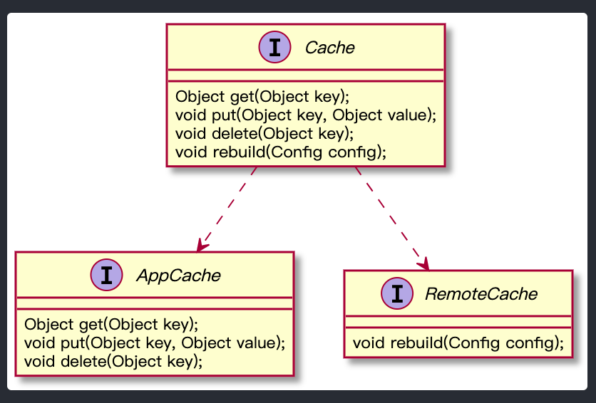

# 训练营第二周作业

## 作业一：请描述什么是依赖倒置原则，为什么有时候依赖倒置原则又被称为好莱坞原则？

在面向对象编程领域中，依赖倒置原则是指一种特定的解耦（传统的依赖关系创建在高层次上，而具体的策略设置则应用在低层次的模块上）形式，使得高层次的模块不依赖于低层次的模块的实现细节，依赖关系被颠倒（反转），从而使得低层次模块依赖于高层次模块的需求抽象。

该原则规定：

1. 高层次的模块不应该依赖于低层次的模块，两者都应该依赖于抽象接口。
2. 抽象接口不应该依赖于具体实现。而具体实现则应该依赖于抽象接口。

好莱坞原则是指演艺公司会去主动找合适的演员，而演员不可以找演艺公司，这就确定了游戏规则，谁更有主动权。依赖倒置原则和好莱坞原则都是用来规定谁更有主动权的两个原则，原理和目标都是一样的。

## 作业二：请描述一个你熟悉的框架，是如何实现依赖倒置原则的。

Spring框架基于依赖倒置原则，实现了依赖注入和控制反转。通过基于构造函数的依赖注入、基于设置方法的依赖注入实现了依赖由框架的控制，而不是由对象的提供者来注入的功能（低层依赖于高层，而不是相反）。依赖注入很好的体现了面向对象设计法则之一—— 好莱坞法则：“别找我们，我们找你”；即由IoC容器帮对象找相应的依赖对象并注入，而不是由对象主动去找。

## 作业三：请用接口隔离原则优化 Cache 类的设计，画出优化后的类图。


作业三提示：cache 实现类中有四个方法，其中 `put` `get` `delete` 方法是需要暴露给应用程序的，`rebuild` 方法是需要暴露给系统进行远程调用的。如果将 `rebuild` 暴露给应用程序，应用程序可能会错误调用 `rebuild` 方法，导致 `cache` 服务失效。按照接口隔离原则：不应该强迫客户程序依赖它们不需要的方法。也就是说，应该使 `cache` 类实现两个接口，一个接口包含 `get` `put` `delete` 暴露给应用程序，一个接口包含 `rebuild` 暴露给系统远程调用。从而实现接口隔离，使应用程序看不到 `rebuild` 方法。



```
@startuml
interface AppCache {
    Object get(Object key);
    void put(Object key, Object value);
    void delete(Object key);
}

interface RemoteCache {
    void rebuild(Config config);
} 

interface Cache {
    Object get(Object key);
    void put(Object key, Object value);
    void delete(Object key);
    void rebuild(Config config);
}

Cache ..> RemoteCache
Cache ..> AppCache

@enduml
```