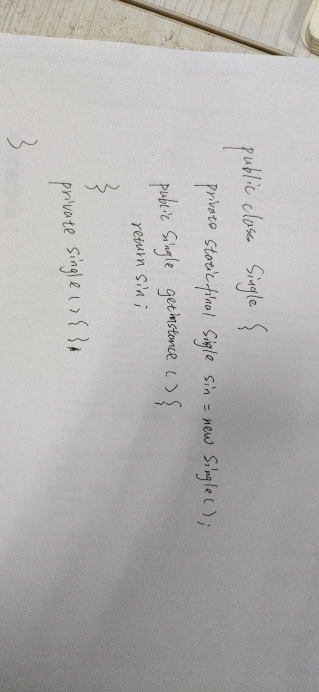
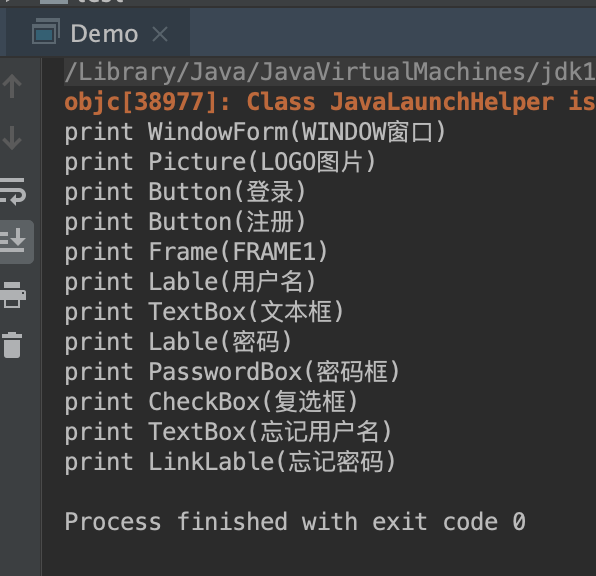

# 训练营第三周作业

## 作业一：

1. 请在草稿纸上手写一个单例模式的实现代码，拍照提交作业。



2. 请用组合设计模式编写程序，打印输出图 1 的窗口，窗口组件的树结构如图 2 所示，打印输出示例参考图 3。


项目代码在[这里](./ComponentDemo)。

**结构**


```java
package com.moodpo.week3;

import lombok.Data;

/**
 * User: moodpo
 * Date: 2020-06-24 20:34
 */
@Data
public abstract class Window {

    private String name;

    public Window(String name) {
        this.name = name;
        this.print();
    }

    private String getType() {
        return this.getClass().getSimpleName();
    }

    private void print() {
        System.out.println(String.format("print %s(%s)", this.getType(), this.getName()));
    }

}

```

**打印***

```java
package com.moodpo.week3;

/**
 * User: moodpo
 * Date: 2020-06-24 20:20
 */
public class Demo {

    public static void main(String[] args) {

        WindowForm windowForm = new WindowForm("WINDOW窗口");
        windowForm.setLogo(new Picture("LOGO图片"));
        windowForm.setLoginButton(new Button("登录"));
        windowForm.setSignButton(new Button("注册"));

        Frame frame = new Frame("FRAME1");
        frame.setUsername(new Lable("用户名"));
        frame.setTextBox(new TextBox("文本框"));
        frame.setPassword(new Lable("密码"));
        frame.setPasswordBox(new PasswordBox("密码框"));
        frame.setCheckBox(new CheckBox("复选框"));
        frame.setForget(new TextBox("忘记用户名"));
        frame.setLinkLable(new LinkLable("忘记密码"));

        windowForm.setFrame(frame);
    }

}

```

**最后结果**

